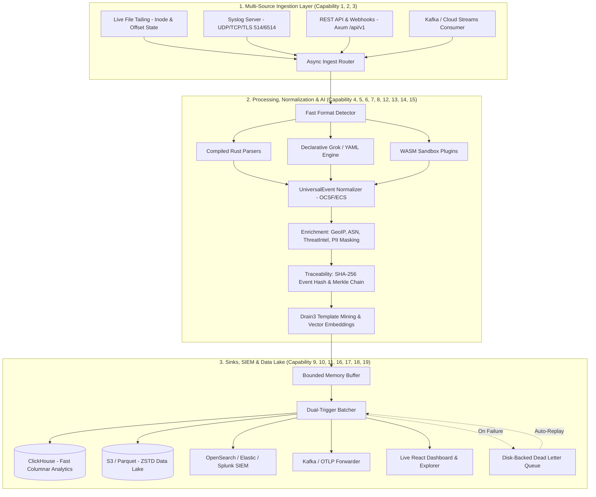

# Helios Enterprise Feature Gap Analysis & Architecture Roadmap

This document provides an in-depth, production-ready audit of Helios's implementation against all **19 enterprise-grade observability and log pre-processing capabilities**. For each capability, it details the **definition and enterprise requirement**, the **current state in Helios**, the **detailed technical architecture and blueprints**, and the **actionable implementation roadmap**.

---

## 1. Executive Summary & Maturity Matrix


| # | Enterprise Capability | Current Status in Helios | Priority Gap | Recommendation / Action |
|---|---|:---:|:---:|---|
| **1** | **Universal Log Ingestion** | ⚠️ Partial (Stub) | Live file tailing, Syslog UDP/TCP/TLS, Kafka, S3 | Implement async source runners in `helios-ingest` |
| **2** | **Multi-Format Log Support** | 🟢 Solid | LEEF, Windows EVTX, CSV, Structured XML | Add EVTX binary parser, LEEF parser, and delimited parser |
| **3** | **Raw Data Preservation** | 🟢 Implemented | None | Retained via `UniversalEvent.raw_event` with zero mutation |
| **4** | **Source-Specific Parsing** | 🟢 Implemented | Dynamic grammar per format | Add declarative Grok engine with SIMD tokenization |
| **5** | **Universal Event Schema** | 🟢 Solid | Full OCSF / ECS taxonomy compliance | Align `UniversalEvent` fields strictly with OCSF v1.1 |
| **6** | **Normalization & Standardization** | 🟢 Solid | GeoIP, ASN, ThreatIntel enrichment | Add MaxMind DB & threat reputation enrichers in `helios-enrichment` |
| **7** | **Event Traceability** | 🟢 Solid | Cryptographic lineage & W3C trace propagation | Add SHA-256 `event_hash`, `ingest_id`, and `traceparent` headers |
| **8** | **Plug-and-Play Onboarding** | ⚠️ Partial | Requires Rust crate compilation | Add YAML/Grok runtime plugin onboarding with hot-reload |
| **9** | **Vendor-Agnostic Architecture** | 🟢 Implemented | None | Strict modular crate boundaries across workspace |
| **10** | **Unified Enterprise Visibility** | ⚠️ Partial | Interactive query explorer & aggregations | Expand React UI with query explorer, histograms, and live charts |
| **11** | **SIEM & Data Lake Integration** | ❌ Missing | ClickHouse, S3/Parquet, OpenSearch, Kafka | Implement high-throughput export sinks in `helios-storage` |
| **12** | **AI/ML Readiness** | ⚠️ Partial | Log template mining & embeddings | Implement Drain3 template clustering and dense embeddings |
| **13** | **Scalable Big Data Processing** | ⚠️ Partial | Multi-worker channels & SIMD batching | Implement MPMC ring buffers and vectorized parsing pipelines |
| **14** | **Extensible Framework** | 🟢 Implemented | Dynamic runtime plugins | Add WASM (`wasmtime`) and C-ABI dynamic shared library loader |
| **15** | **Reduced Parser Effort** | ⚠️ Partial | Manual regex development | Implement declarative rule builder and regex auto-generator |
| **16** | **Forensic & Compliance Support** | ⚠️ Partial | Tamper-proof audit logs / WORM | SHA-256 Merkle chain verification and S3 Object Lock support |
| **17** | **Air-Gapped Deployment** | 🟢 Solid | Offline GeoIP / Threat feeds | Pre-bundle MaxMind DB and static self-contained binaries |
| **18** | **Containerized & Platform-Independent** | 🟢 Solid | Helm charts & multi-arch Docker | Multi-stage scratch/Alpine Dockerfile & Kubernetes Helm chart |
| **19** | **Future-Ready Architecture** | 🟢 Solid | OpenTelemetry standards & Async Tokio | Maintain zero-copy async Rust core with OTLP standard APIs |

---

## 2. In-Depth Explanation of All 19 Enterprise Capabilities

```
┌──────────────────────────────────────────────────────────────────────────────────────────────────┐
│                                    HELIOS CORE DATA PIPELINE                                     │
│                                                                                                  │
│   [Sources] ──► [Ingest] ──► [Detector] ──► [Parsers] ──► [Normalizer] ──► [Enrichment] ──► [Sinks] │
│    Files         TCP/UDP       Heuristic      Compiled       OCSF / ECS        GeoIP / ASN    ClickHouse │
│    Kafka         HTTP API      Regex Match    Declarative    Taxonomy          Threat Intel   S3 Parquet │
│    CloudWatch    S3 Puller     SIMD Peek      Grok / WASM    Timestamps        Template Miner OpenSearch │
└──────────────────────────────────────────────────────────────────────────────────────────────────┘
```

---

### 1. Universal Log Ingestion
* **Enterprise Requirement**: Large enterprises produce logs from tens of thousands of heterogeneous endpoints—bare-metal servers, Kubernetes pods, network firewalls, cloud services, and message buses. An enterprise pre-processing platform must ingest logs continuously over streaming protocols with stateful offset tracking and backpressure control.
* **Current State in Helios**: [`helios-ingest/src/lib.rs`](file:///home/LeeFred3042U/code/helios/helios-ingest/src/lib.rs) defines a `LogSource` asynchronous trait. The `FileSource` is currently an empty stub (`Ok(())`).
* **Technical Blueprint & Architecture**:
  * **Live File Tailing**: Integrates `linemux` or `notify` with inode-aware tracking and persistent byte-offset state files to handle log rotation (`logrotate`) without event loss or duplication.
  * **Syslog Network Server**: Tokio-based asynchronous listener supporting Syslog over **UDP (RFC 3164)**, **TCP (RFC 5424)**, and **TLS (RFC 5425)** on ports 514/6514.
  * **Cloud & Distributed Ingest**: Asynchronous consumers for **Apache Kafka / AWS Kinesis** and automated batch pullers for **AWS S3 / CloudWatch Logs**.
  * **Backpressure & Bounded Channels**: Tokio MPSC channels with configurable capacity buffers (`channel_capacity: 100000`) ensuring upstream throttling during downstream sink latency.

```rust
// helios-ingest/src/source.rs
#[async_trait]
pub trait LogSource: Send + Sync {
    fn name(&self) -> &str;
    async fn start(&self, tx: tokio::sync::mpsc::Sender<RawLogEvent>) -> Result<()>;
    async fn stop(&self) -> Result<()>;
}
```

---

### 2. Multi-Format Log Support
* **Enterprise Requirement**: Infrastructure logs span legacy text formats, modern JSON streams, enterprise security appliances, and binary operating system logs. The engine must seamlessly identify and parse all standard enterprise formats without requiring pre-classification by the user.
* **Current State in Helios**: 11 dedicated parser crates in `parsers/`:
  * `helios-parser-syslog` (RFC 3164 BSD & RFC 5424)
  * `helios-parser-json` (Structured JSON lines)
  * `helios-parser-cef` (Common Event Format)
  * `helios-parser-apache` (Common & Combined)
  * `helios-parser-nginx` (Standard access logs)
  * `helios-parser-openssh` (Authentication & session logs)
  * `helios-parser-windows` (CBS / Application logs)
  * `helios-parser-android` (Logcat threadtime)
  * `helios-parser-zookeeper` (Apache ZooKeeper logs)
  * `helios-parser-spark` (Spark driver/executor logs)
  * `helios-parser-proxifier` (Client proxy connection logs)
* **Missing Formats & Roadmap Upgrades**:
  * **Windows EVTX**: Native parsing of binary XML Windows Event Logs (`.evtx`) using chunk/record header decoders.
  * **LEEF (Log Event Extended Format)**: Native parser for IBM QRadar security appliances.
  * **Generic Delimited (CSV/TSV)**: Dynamic header mapping for CSV/TSV audit reports.
  * **Structured XML**: Enterprise XML application logs.

---

### 3. Raw Data Preservation
* **Enterprise Requirement**: In security forensics, incident response, and regulatory compliance (PCI-DSS 10.5, HIPAA, SOC 2), original log strings must be retained with 100% byte fidelity. Any mutation, truncation, or omission invalidates forensic admissibility.
* **Current State in Helios**: Fully implemented. Every [`UniversalEvent`](file:///home/LeeFred3042U/code/helios/helios-core/src/event.rs#L19) retains the exact, unaltered input string in `pub raw_event: String`.
* **Technical Blueprint**:
  * Guarantee zero destructive transformations on `raw_event`.
  * For memory-constrained environments, implement optional `zstd` compressed dictionary buffers for storing raw payloads in RAM before flushing to persistent storage.

---

### 4. Source-Specific Parsing
* **Enterprise Requirement**: Different log sources contain unique domain models (HTTP request methods, database query execution times, firewall drop codes, SSH public key fingerprints). Parsers must extract domain-specific semantics into structured fields without flattening all data into generic strings.
* **Current State in Helios**: Each parser crate parses specific fields (e.g. `helios-parser-cef` extracts device vendor, signature IDs, and extension pairs; `helios-parser-apache` extracts HTTP methods, status codes, and referrers).
* **Technical Blueprint & Upgrades**:
  * Implement zero-copy tokenization using string slices (`&str`) to minimize memory allocations.
  * Supplement compiled parsers with a high-throughput **Declarative Grok Engine** that interprets custom extraction patterns at runtime.

---

### 5. Universal Event Schema
* **Enterprise Requirement**: Downstream data consumers (SIEMs, dashboards, ML models) should not need to understand hundreds of vendor-specific field names (`saddr`, `src_ip`, `c-ip`, `SourceAddress`). All events must be normalized into a unified, standardized schema.
* **Current State in Helios**: [`UniversalEvent`](file:///home/LeeFred3042U/code/helios/helios-core/src/event.rs) contains structured objects for `ProcessInfo`, `NetworkInfo`, `TraceInfo`, and arbitrary key-value attributes.
* **Technical Blueprint & Taxonomy Alignment**:
  * Align field naming strictly with **OCSF (Open Cybersecurity Schema Framework)** and **ECS (Elastic Common Schema)**.

```rust
// helios-core/src/event.rs
#[derive(Debug, Clone, Serialize, Deserialize)]
pub struct UniversalEvent {
    pub timestamp: DateTime<Utc>,
    pub hostname: Option<String>,
    pub service: Option<String>,
    pub severity: Option<String>,
    pub message: String,
    pub raw_event: String,
    pub event_hash: Option<String>,
    pub process: Option<ProcessInfo>,
    pub network: Option<NetworkInfo>,
    pub user: Option<UserInfo>,
    pub trace: Option<TraceInfo>,
    pub metadata: HashMap<String, serde_json::Value>,
    pub attributes: HashMap<String, serde_json::Value>,
}
```

---

### 6. Normalization & Standardization
* **Enterprise Requirement**: Real-world logs use inconsistent timestamps (`10/Oct/2000:13:55:36 -0700`, `Jan 18 11:07:53`, epoch milliseconds), mixed severity labels (`3`, `CRIT`, `Fatal`, `ERR`), and un-enriched network IPs. Normalization standardizes these dimensions upon ingestion.
* **Current State in Helios**: Timestamps are parsed into `chrono::DateTime<Utc>`, severity is standardized into uppercase strings (`INFO`, `WARN`, `ERROR`, `CRIT`), and network fields are mapped into `NetworkInfo`.
* **Technical Blueprint & Enrichment Pipeline**:
  * **GeoIP & ASN Lookup**: Fast, offline IP resolution in `helios-enrichment` using MaxMind `.mmdb` databases (`maxminddb` crate), injecting country, city, ASN, and organization into `metadata`.
  * **Threat Intel Enrichment**: Local cache lookup of known malicious IPs, Tor exit nodes, and botnet C2 servers.

---

### 7. Event Traceability & Lineage
* **Enterprise Requirement**: When investigating security incidents, engineers must verify the provenance, ingestion timestamp, collector node ID, and distributed trace context of every event.
* **Current State in Helios**: Basic trace context (`TraceInfo` containing `trace_id` and `span_id`) is defined in `UniversalEvent`.
* **Technical Blueprint**:
  * **Cryptographic Event Hash**: Automatic calculation of `SHA-256(raw_event + timestamp)` stored in `UniversalEvent.event_hash`.
  * **Ingestion Metadata**: Injecting `ingest_timestamp`, `ingest_node_id`, and `stream_id` into `UniversalEvent.metadata`.
  * **W3C Trace Context**: Automatic parsing and propagation of `traceparent` and `tracestate` headers across distributed system logs.

---

### 8. Plug-and-Play Onboarding
* **Enterprise Requirement**: Enterprise operations teams cannot afford to recompile Rust code or redeploy binaries every time an internal development team deploys a new service or changes a log format. Adding a new log parser must be declarative and instantaneous.
* **Current State in Helios**: Parsers are currently compiled Rust crates registered at startup in `Registry`.
* **Technical Blueprint**:
  * **Declarative Grok / YAML Parser Loader**: Dynamic loading of parser definitions from `config/parsers/*.yaml` at runtime.
  * **Hot-Reloading File Watcher**: `notify`-based watcher that reloads parser definitions when YAML files are modified without restarting the Helios service.

```yaml
# config/parsers/payment-gateway.yaml
name: "payment-gateway"
description: "Core payment processing service log"
version: "1.0.0"
detect: "^\\[PAYMENT\\] \\d{4}-\\d{2}-\\d{2}"
grok_pattern: "\\[PAYMENT\\] %{TIMESTAMP_ISO8601:timestamp} \\[%{LOGLEVEL:severity}\\] txn_id=%{WORD:txn_id} user=%{USER:user} amount=%{NUMBER:amount:float} msg=%{GREEDYDATA:message}"
mapping:
  timestamp: "timestamp"
  severity: "severity"
  service: "payment-gateway"
  attributes:
    "payment.txn_id": "txn_id"
    "payment.user": "user"
    "payment.amount": "amount"
```

---

### 9. Vendor-Agnostic Architecture
* **Enterprise Requirement**: Enterprises avoid single-vendor lock-in (e.g. Datadog, Splunk, Elastic) by decoupling their log ingestion, transformation, and storage layers.
* **Current State in Helios**: Clean modular crate boundaries:
  * `helios-core`: Schema and error definitions.
  * `helios-parser`: Trait definitions and registry.
  * `helios-detector`: Format identification engine.
  * `helios-enrichment`: Context enrichment.
  * `helios-storage`: Persistence abstractions.
  * `helios-api`: HTTP REST API.
  * `helios-cli`: Terminal CLI.
* **Guarantee**: Clean trait-based decoupling guarantees that any source or sink can be substituted without touching parser logic.

---

### 10. Unified Enterprise Visibility
* **Enterprise Requirement**: Operations and security teams require immediate real-time visibility into ingestion volume, parsing success rates, error spikes, and log contents through an intuitive graphical dashboard.
* **Current State in Helios**: Modern React 19 + TypeScript frontend with Vite, Tailwind CSS, and shadcn/ui components in `frontend/`.
* **Technical Blueprint & Upgrades**:
  * **Live Stream Explorer**: Real-time log tailing over WebSockets (`/api/v1/stream`) with search filtering and syntax highlighting.
  * **Metrics & Aggregations**: Interactive time-series histograms of events/sec, format distribution breakdown, and detector latency metrics.
  * **Visual Regex / Grok Sandbox**: Interactive parser testing playground allowing developers to test regex/grok rules against raw logs in real time.

---

### 11. SIEM & Data Lake Integration
* **Enterprise Requirement**: High-throughput, fault-tolerant multiplexing of parsed `UniversalEvent` records to analytical columnar databases, cloud object storage data lakes, enterprise SIEM platforms, and distributed streaming message buses.
* **Current State in Helios**: [`helios-storage/src/lib.rs`](file:///home/LeeFred3042U/code/helios/helios-storage/src/lib.rs) provides a `StorageBackend` trait with an empty `SqliteStorage` stub.

#### Target Sinks & Connector Specifications:

1. **ClickHouse High-Performance Columnar Sink (Real-time Analytics)**
   - **Role**: Primary real-time SQL analytics sink for petabyte-scale log queries, aggregations, and dashboards at millions of events/sec.
   - **Transport**: Asynchronous HTTP / Native TCP protocol via `clickhouse-rs` with `RowBinary` or `Native` format streaming.
   - **Target Table DDL & Schema Mapping**:
     ```sql
     CREATE TABLE IF NOT EXISTS helios.universal_events (
         timestamp DateTime64(3, 'UTC') CODEC(DoubleDelta, ZSTD(1)),
         event_hash FixedString(32) CODEC(None),
         service LowCardinality(String) CODEC(ZSTD(1)),
         severity LowCardinality(String) CODEC(ZSTD(1)),
         hostname LowCardinality(Nullable(String)) CODEC(ZSTD(1)),
         message String CODEC(ZSTD(3)),
         raw_event String CODEC(ZSTD(6)),
         process_pid Nullable(UInt32),
         process_name LowCardinality(Nullable(String)),
         thread_id Nullable(UInt32),
         thread_name Nullable(String),
         source_ip Nullable(IPv6),
         source_port Nullable(UInt16),
         destination_ip Nullable(IPv6),
         destination_port Nullable(UInt16),
         protocol LowCardinality(Nullable(String)),
         trace_id Nullable(String),
         span_id Nullable(String),
         metadata Map(String, String) CODEC(ZSTD(1)),
         attributes Map(String, String) CODEC(ZSTD(1))
     ) ENGINE = ReplacingMergeTree(timestamp)
     PARTITION BY toYYYYMM(timestamp)
     PRIMARY KEY (service, severity, timestamp)
     ORDER BY (service, severity, timestamp, event_hash)
     SETTINGS index_granularity = 8192;
     ```

2. **Data Lake S3 / Parquet Sink (Long-Term Retention & Cold Analytics)**
   - **Role**: Highly compressed, schema-optimized archival storage for querying via DuckDB, Apache Spark, Trino, Athena, or Snowflake.
   - **Format**: Apache Parquet with `ZSTD` or `Snappy` columnar compression using Apache Arrow Rust (`arrow` & `parquet` crates).
   - **Object Partitioning Scheme**:
     `s3://{bucket}/helios-lake/year={YYYY}/month={MM}/day={DD}/service={service}/{batch_uuid}.parquet`

3. **Enterprise SIEM Exporters**
   - **OpenSearch / Elasticsearch Bulk Sink**: Utilizes the `_bulk` NDJSON API with automatic daily/monthly index rollover (`helios-events-YYYY.MM.DD`) and ECS mapping.
   - **Splunk HEC (HTTP Event Collector)**: Pushes raw and structured JSON batches to `/services/collector/event` with gzip compression.
   - **Microsoft Sentinel / Azure Log Analytics**: Integrates with Azure Monitor Ingestion API (DCR-based).

4. **Distributed Streaming & Message Bus Sinks**
   - **Apache Kafka / Redpanda Producer**: Partition keying by `service`, `hostname`, or `tenant_id` for deterministic stream distribution using `rdkafka`.
   - **OpenTelemetry (OTLP/gRPC) Forwarder**: Exports standard OTLP Logs over gRPC/HTTP to OpenTelemetry Collectors.

#### Buffer, Batching & Resilience Guarantees:
* **Dual-Trigger Batching Engine**: Flushes on batch size limit (e.g. 10,000 events / 16 MB) or time interval (`flush_interval_ms: 1000ms`).
* **Dead-Letter Queue (DLQ) & Disk-Backed WAL**: Persists failed batches to local disk storage (`data/dlq/`) during network outages, replaying automatically with exponential backoff upon reconnection.

---

### 12. AI / ML Readiness (Log Template Clustering & Embeddings)
* **Enterprise Requirement**: Modern SOCs and AIOps platforms require log clustering to detect anomalous log surges, extract unknown error templates, and generate vector embeddings for LLM-assisted root-cause analysis (RAG).
* **Current State in Helios**: Parses raw logs into structured JSON fields.
* **Technical Blueprint**:
  * **Drain3 Online Log Template Mining**: Implementation of the Drain tree clustering algorithm in Rust. Automatically replaces dynamic variables (IPs, UUIDs, numbers) with `<*>` wildcards to extract log message templates and assign deterministic `template_id`s in sub-millisecond time.
  * **Dense Vector Embeddings**: Pre-formatting log templates and metadata into semantic text embeddings for indexing in vector databases (Qdrant / Milvus) for LLM anomaly detection.

---

### 13. Scalable Big Data Processing
* **Enterprise Requirement**: Enterprise pipelines must handle sustained throughputs exceeding 100,000–500,000 events/second per node with low CPU and memory footprints.
* **Current State in Helios**: Single-threaded file reader in CLI; async Axum REST API in `helios-api`.
* **Technical Blueprint**:
  * **Multi-Worker Pipeline Architecture**: Tokio async runtime distributing log streams across lock-free bounded MPMC channels to a pool of worker threads.
  * **SIMD-Accelerated Format Detection**: Utilizing AVX2/NEON vector instructions (`memchr` / `simd-json`) for fast prefix scanning and whitespace/delimiter splitting.
  * **Zero-Copy Batching**: Passing memory buffers by reference without intermediate string cloning.

---

### 14. Extensible Framework (WASM & Dynamic Plugins)
* **Enterprise Requirement**: Organizations need to write proprietary parsing and enrichment logic in languages of their choice (C/C++, Rust, Go, Python) and deploy them dynamically without rebuilding the core binary.
* **Current State in Helios**: `Parser` and `StorageBackend` traits implemented via Rust static compilation.
* **Technical Blueprint**:
  * **WebAssembly (WASM) Plugin Engine**: Embed `wasmtime` runtime to execute sandboxed `.wasm` parser plugins with memory isolation and strict execution timeouts.
  * **C-ABI Dynamic Shared Libraries (`.so` / `.dylib` / `.dll`)**: Dynamic loading via `libloading` for ultra-high performance proprietary plugins.

---

### 15. Reduced Parser Development Effort
* **Enterprise Requirement**: Writing complex regular expressions for hundreds of bespoke in-house log formats is error-prone, slow, and expensive.
* **Current State in Helios**: Hardcoded regex constants per crate (`DETECT_RE` + `CAPTURE_RE`).
* **Technical Blueprint**:
  * **Declarative Grok Pattern Library**: Pre-bundle 100+ standard reusable Grok patterns (`%{IPV4}`, `%{TIMESTAMP_ISO8601}`, `%{WORD}`, `%{NUMBER}`, `%{QUOTEDSTRING}`).
  * **Automatic Regex Generator & Synthesis**: Implement an algorithm that ingests 5–10 sample log lines, detects repeating structural tokens, and automatically proposes an optimized regex/grok pattern.

---

### 16. Forensic & Compliance Support
* **Enterprise Requirement**: Regulated industries (banking, healthcare, defense) require proof that log records have not been tampered with or deleted after the fact.
* **Current State in Helios**: Raw event preservation in `UniversalEvent.raw_event`.
* **Technical Blueprint**:
  * **Cryptographic Block Chaining (Merkle Hashes)**: Every event computes `hash = SHA256(prev_event_hash + current_raw_event + timestamp)`. A broken hash immediately alerts auditors to tampering or record deletion.
  * **WORM (Write Once Read Many) Storage**: Native support for AWS S3 Object Lock in Compliance Mode.
  * **PII Redaction & Masking**: Regex-based masking rules in `helios-enrichment` replacing credit card numbers, passwords, and SSNs with `[REDACTED]` prior to storage.

---

### 17. Air-Gapped Deployment
* **Enterprise Requirement**: Defense, national security, and high-security banking environments operate in air-gapped networks with zero access to the public internet.
* **Current State in Helios**: Zero cloud runtime dependencies; self-contained Rust binaries.
* **Technical Blueprint**:
  * **Pre-bundled Offline Assets**: Embed offline MaxMind GeoLite2 databases and threat feed tarballs directly in the release container.
  * **Zero Telemetry**: Completely disable external outbound network calls or cloud telemetry reporting.

---

### 18. Containerized & Platform-Independent
* **Enterprise Requirement**: The platform must deploy effortlessly across Kubernetes clusters, bare-metal Linux servers, macOS developer laptops, and Windows Server infrastructure.
* **Current State in Helios**: Rust workspace builds standalone static binaries for Linux and macOS.
* **Technical Blueprint**:
  * **Multi-Stage Scratch / Alpine Dockerfile**: Produces ultra-lightweight container images (< 35 MB) containing the compiled Axum API server and static React frontend assets.
  * **Kubernetes Helm Chart**: Production-ready Helm chart with DaemonSet/Deployment modes, horizontal pod autoscaling (HPA), and ConfigMaps.

---

### 19. Future-Ready Architecture
* **Enterprise Requirement**: The architecture must easily integrate with next-generation AI agents, vector databases, and OpenTelemetry standards without requiring architectural rewrites.
* **Current State in Helios**: Modern Rust 2021 edition workspace with Tokio asynchronous runtime, Serde serialization, and modular crate design.
* **Technical Blueprint**:
  * **OpenTelemetry OTLP First**: Native support for OTLP v1.0 log protobuf data structures.
  * **AI Agentic Integration**: REST and WebSocket APIs designed for automated querying and real-time log ingestion by AI observability agents.

---

## 3. End-to-End Architectural Data Flow



---

## 4. Prioritized Implementation Roadmap

### Phase 1: Ingestion Engine & Storage Sinks (Immediate Priority)
1. **Implement `FileSource` live tailing** in `helios-ingest` with checkpoint state and rotation handling.
2. **Implement `SyslogServer` (UDP & TCP)** listener in `helios-ingest`.
3. **Implement ClickHouse & S3/Parquet storage engines** in `helios-storage` with dual-trigger batching and DLQ.

### Phase 2: Declarative Rules & Enrichment (Medium Term)
4. **Declarative Grok / YAML Parser Engine**: Support dropping `.yaml` files into `config/parsers/` with live hot-reloading.
5. **GeoIP & Threat Intel Enrichers**: Offline MaxMind `.mmdb` integration in `helios-enrichment`.
6. **Additional Parsers**: Add native support for Windows EVTX, LEEF, and delimited CSV/TSV.

### Phase 3: AI/ML, Forensics & Cloud Native (Advanced)
7. **Drain3 Log Template Extraction**: Auto-generate template IDs and variable extraction masks for ML anomaly detection.
8. **Tamper-Proof Audit Hashing**: Cryptographic Merkle block-hash chaining for forensic compliance.
9. **Container & Helm Packaging**: Multi-arch Dockerfile (< 35 MB) and production Kubernetes Helm charts.
