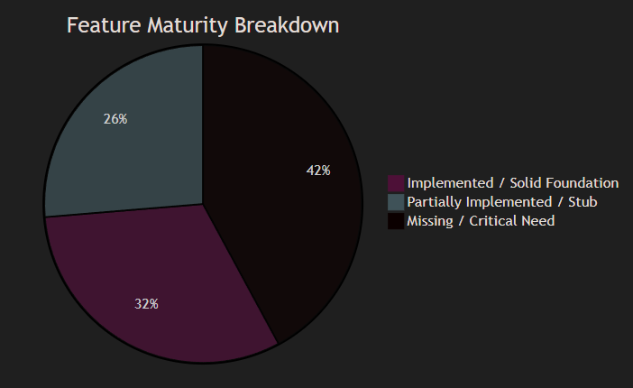
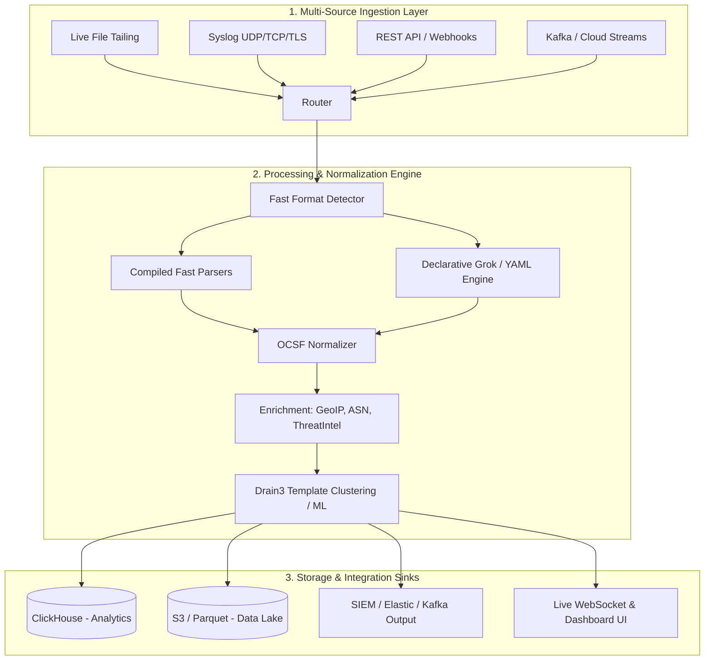

# Helios Enterprise Feature Gap Analysis & Architecture Roadmap

This document provides an in-depth audit of Helios's current implementation against the **19 enterprise-grade observability and log pre-processing capabilities**, detailing what is **currently implemented**, what is **missing or needed**, and what components **can be replaced or upgraded**.


> **Note: The big Question How the hell do we avoid running 100 detectors against every line**
---

## 1. Executive Summary & Maturity Matrix




| # | Enterprise Capability | Current Status in Helios | Priority Gap | Recommendation / Action |
|---|---|:---:|:---:|---|
| **1** | **Universal Log Ingestion** | ⚠️ Partial (Stub) | File, TCP/UDP Syslog, Kafka, S3 | Implement async source runners in `helios-ingest` |
| **2** | **Multi-Format Log Support** |  Solid | XML, CSV, LEEF, Windows EVTX | Add LEEF, EVTX, and declarative parser configs |
| **3** | **Raw Data Preservation** |  Implemented | None | Retained via `UniversalEvent.raw_event` |
| **4** | **Source-Specific Parsing** |  Implemented | Static regexes per crate | Introduce declarative Grok/WASM parser engine |
| **5** | **Universal Event Schema** |  Solid | Taxonomy standard (OCSF/ECS) | Align `UniversalEvent` fields with OCSF taxonomy |
| **6** | **Normalization & Standardization** |  Solid | GeoIP, ASN, Identity mapping | Add GeoIP / ThreatIntel enrichers in `helios-enrichment` |
| **7** | **Event Traceability** |  Solid | Lineage hashing & trace context | Add `hash` / `ingest_id` and W3C trace propagation |
| **8** | **Plug-and-Play Onboarding** | ⚠️ Partial | Requires Rust crate compilation | Add YAML / Grok declarative plugin onboarding |
| **9** | **Vendor-Agnostic Architecture** |  Implemented | None | Clean separation of concerns across crates |
| **10** | **Unified Enterprise Visibility** | ⚠️ Partial | Frontend aggregations & filtering | Expand React UI with query explorer and charts |
| **11** | **SIEM & Data Lake Integration** | ❌ Missing | ClickHouse, S3/Parquet, OpenSearch | Implement export sinks in `helios-storage` |
| **12** | **AI/ML Readiness** | ⚠️ Partial | Log template mining & embeddings | Add Drain3 log clustering & vector output |
| **13** | **Scalable Big Data Processing** | ⚠️ Partial | Distributed partitioning & batching | Vectorized SIMD parsing & multi-worker channels |
| **14** | **Extensible Framework** |  Implemented | Parser & Enricher traits in place | Support WASM / dynamic shared library plugins |
| **15** | **Reduced Parser Effort** | ⚠️ Partial | Hardcoded regex development | Declarative rule builder / regex auto-generator |
| **16** | **Forensic & Compliance Support** | ⚠️ Partial | Tamper-proof audit logs / WORM | SHA-256 event chaining & cryptographic hashing |
| **17** | **Air-Gapped Deployment** |  Solid | Offline GeoIP DB & zero-cloud deps | Pre-bundle MaxMind DB & embedded assets |
| **18** | **Containerized & Platform-Independent** |  Solid | Standalone static Rust binaries | Multi-arch Dockerfile & Kubernetes Helm chart |
| **19** | **Future-Ready Architecture** |  Solid | Modular crate workspace design | Keep async Tokio runtime + OpenTelemetry standards |

---

## 2. In-Depth Capability Breakdown & Gap Analysis

### 1. Universal Log Ingestion
- **Current State**: [`helios-ingest/src/lib.rs`](file:///home/LeeFred3042U/code/helios/helios-ingest/src/lib.rs) defines a `LogSource` async trait, but `FileSource` is currently an empty stub (`Ok(())`).
- **Missing / Needed**:
  - Live file tailer with stateful byte-offset tracking and log rotation handling (`notify` / `linemux`).
  - Network ingestion listeners: **Syslog UDP/TCP/TLS (RFC 5425)**, **HTTP Ingestion Endpoint**, **Kafka Consumer**, and **AWS S3 / CloudWatch pullers**.
  - Rate limiting, bounded ring buffers, and backpressure mechanisms.
- **Can Be Replaced / Upgraded**:
  - Replace the current empty `LogSource::run` stubs with Tokio-based streaming channels (`tokio::sync::mpsc::channel`).

---

### 2. Multi-Format Log Support
- **Current State**: 11 dedicated parser crates: Syslog (RFC 3164/5424), JSON, Apache, Nginx, CEF, ZooKeeper, Spark, Windows CBS, Android, OpenSSH, Proxifier.
- **Missing / Needed**:
  - **LEEF (Log Event Extended Format)**: IBM QRadar format.
  - **Windows EVTX (XML / Binary XML)**: Standard Event Log format.
  - **Generic Delimited (CSV / TSV)** with dynamic header mappings.
  - **Structured XML** parser.

---

### 3. Raw Data Preservation & 7. Event Traceability
- **Current State**: Every `UniversalEvent` includes `raw_event: String`, preserving 100% of the unaltered log line.
- **Missing / Needed**:
  - **Cryptographic Lineage**: SHA-256 hash of `raw_event` for tamper verification (`event_hash`).
  - **Ingest Metadata**: Adding `ingest_timestamp`, `source_node_id`, and `stream_id` to `UniversalEvent.metadata`.
  - **W3C Distributed Trace Injection**: Ingesting trace headers (`traceparent`) into `UniversalEvent.trace`.

---

### 4. Source-Specific Parsing & 15. Reduced Parser Development Effort
- **Current State**: Each parser is a dedicated Rust crate compiled into the binary with regex pairs (`DETECT_RE` + `CAPTURE_RE`).
- **Can Be Replaced / Upgraded**:
  > [!TIP]
  > **High-Leverage Upgrade**: Replace the requirement of compiling a full Rust crate for every simple log format with a **Declarative Grok / Regex Engine** (loaded from YAML/TOML configs at runtime).

  ```yaml
  # Example: config/parsers/custom-app.yaml
  name: "custom-app"
  detect: "^\\d{4}-\\d{2}-\\d{2} \\[(INFO|ERROR)\\]"
  grok_pattern: "%{TIMESTAMP_ISO8601:timestamp} \\[%{LOGLEVEL:severity}\\] %{GREEDYDATA:message}"
  ```

---

### 5. Universal Event Schema & 6. Normalization
- **Current State**: [`UniversalEvent`](file:///home/LeeFred3042U/code/helios/helios-core/src/event.rs) contains structured objects for `ProcessInfo`, `NetworkInfo`, `TraceInfo`, and arbitrary key-value attributes.
- **Missing / Needed**:
  - **OCSF / ECS Schema Alignment**: Normalize field names (e.g. `src_ip`, `dst_ip`, `user.name`, `http.status_code`) to adhere strictly to Open Cybersecurity Schema Framework (OCSF) or Elastic Common Schema (ECS).
  - **Active Enrichment Pipeline**: Implement real GeoIP (MaxMind `maxminddb`), ASN lookup, and threat intel IP reputation enrichers in [`helios-enrichment`](file:///home/LeeFred3042U/code/helios/helios-enrichment/src/lib.rs).

---

### 11. SIEM & Data Lake Integration
- **Current State**: [`helios-storage`](file:///home/LeeFred3042U/code/helios/helios-storage/src/lib.rs) has a `StorageBackend` trait with an empty `SqliteStorage` stub.
- **Missing / Needed**:
  - **ClickHouse Sink**: Ultra-fast columnar persistence for real-time analytics at billions of events/day.
  - **Parquet / S3 / Iceberg Sink**: Writing compressed batches (`zstd` Parquet) to object storage for Data Lakes.
  - **OpenSearch / Elasticsearch Exporter**: Bulk indexing for enterprise SIEM ingestion.
  - **Kafka / Vector / Fluentd Output**: Forwarding parsed universal events to downstream message buses.

---

### 12. AI / ML Readiness (Log Template Clustering & Embeddings)
- **Current State**: Parses logs into structured JSON fields.
- **Missing / Needed**:
  - **Log Template Mining (Drain3 / Spell algorithm)**: Automatically extracting dynamic parameters vs static templates (`<*>` masks) and assigning cluster IDs (`template_id`).
  - **Vector Embeddings Ready**: Formatting log messages into dense semantic embeddings for anomaly detection models and LLM RAG pipelines.

---

### 16. Forensic & Compliance Support
- **Missing / Needed**:
  - **WORM (Write Once Read Many) compliant storage integration**.
  - **Chain of Custody**: Chained Merkle tree hashes (`prev_hash` + `curr_hash`) ensuring log records cannot be deleted or altered retroactively.

---

### 17. Air-Gapped & 18. Containerized Deployment
- **Current State**: Zero external runtime network dependencies; self-contained Rust binaries.
- **Missing / Needed**:
  - Multi-stage Dockerfile packaging the Axum backend and React static frontend into a single lightweight scratch / Alpine container (< 35 MB).
  - Offline GeoIP and Threat Feed tarball loaders.

---

## 3. Recommended Architectural Upgrade Plan



---

## 4. Prioritized Implementation Roadmap

### Phase 1: Real Ingestion & Storage Sinks (Immediate)
1. **Implement `FileSource` live tailing** in `helios-ingest` with checkpoint state.
2. **Implement `SyslogServer` (UDP & TCP)** listener in `helios-ingest`.
3. **Implement ClickHouse & SQLite storage engines** in `helios-storage`.

### Phase 2: Declarative Rules & Enrichment (Medium Term)
4. **Declarative Grok / YAML Parser Engine**: Enable users to drop `.yaml` files into `config/parsers/` without compiling Rust code.
5. **GeoIP & Threat Intel Enrichers**: Offline MaxMind `.mmdb` integration in `helios-enrichment`.

### Phase 3: AI/ML & Compliance (Advanced)
6. **Drain3 Log Template Extraction**: Auto-generate template IDs and variable extraction masks for ML anomaly detection.
7. **Tamper-Proof Audit Hashing**: Cryptographic block-hash chaining for forensic compliance.
