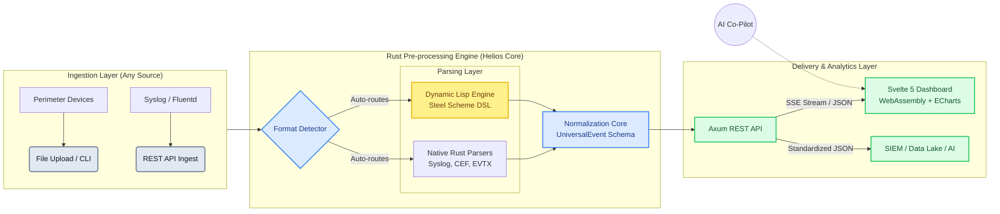

# Helios: Universal Log Pre-processing Framework (ULPF)
**Architecture & Data Flow Document**

*This architecture is designed for extreme throughput, zero-downtime extensibility, and deployment in air-gapped or Big Data environments.*

## 1. High-Level Architecture Diagram

## 2. Core Component Breakdown

**1. Multi-Modal Ingestion Layer**
Supports ingestion via static file uploads (Big Data batch processing), command-line execution, or real-time streaming via a high-throughput Axum REST API. Agnostic to the underlying hardware or perimeter device.

**2. Auto-Detection Engine (`helios-detector`)**
A zero-config routing layer that analyzes byte-signatures and regex heuristics of incoming logs to dynamically map them to the correct parser without user intervention.

**3. Hybrid Parsing Layer**
- **Native Parsers (`helios-parser`):** Hardcoded Rust implementations for standard, high-volume formats (Syslog, CEF, EVTX, JSON) ensuring maximum CPU efficiency.
- **Dynamic DSL Engine (`helios-lisp`):** An embedded Steel Scheme (Lisp) engine allowing security engineers to drop in custom parser scripts (`.scm`) at runtime. Satisfies the *"plug-and-play onboarding"* requirement with zero Rust recompilation.

**4. Normalization Core (`helios-core`)**
Transforms heterogeneous parsed data into a strict `UniversalEvent` schema. It enforces **Traceability** by appending the parsed fields alongside the pristine, untouched `raw_event` string to ensure zero information loss for legal/forensic compliance.

**5. Presentation & Delivery Layer (`web/`)**
A containerized, static Svelte 5 Single Page Application (SPA). Features infinite DOM virtualization and ECharts to render millions of events. Can be served via Caddy in an **air-gapped network**, while exposing structured JSON endpoints for seamless integration with external SIEMs and Data Lakes.
